# Retail Insights Assistant - Architecture & Design

## 1. System Architecture

The system follows a **Multi-Agent Architecture** orchestrated by a central manager.

### High-Level Design (Mermaid)

```mermaid
graph TD
    User([👤 User]) <--> UI[💻 Streamlit UI]
    UI <--> Orchestrator[🧠 Orchestrator Agent]
    
    subgraph "Multi-Agent Core"
        Orchestrator --> QueryAgent[🔍 Query Resolution Agent]
        Orchestrator --> DataAgent[🗄️ Data Extraction Agent]
        Orchestrator --> Validator[✅ Validation Agent]
    end
    
    QueryAgent --> LLM((☁️ Gemini LLM))
    DataAgent --> DB[(🛢️ DuckDB / Data Warehouse)]
    Validator --> LLM
    
    DB --> DataAgent
    DataAgent --> Orchestrator
```

### Data Flow
1.  **User Query**: Natural language input via Streamlit.
2.  **Orchestration**: The central agent analyzes intent.
3.  **Resolution**: Maps terms to database schema (Text-to-SQL).
4.  **Extraction**: Executes optimized SQL on DuckDB (100GB+ ready).
5.  **Validation**: Checks data quality and logic.
6.  **Response**: LLM generates business insight.

### Components
1.  **User Interface (Streamlit)**: Handles file uploads and chat interaction.
2.  **Orchestrator**: Manages the lifecycle of a query.
3.  **Agents**:
    *   **Query Resolution Agent**: Translates Natural Language -> SQL (DuckDB dialect).
    *   **Data Extraction Agent**: Executes SQL on the local DuckDB instance.
    *   **Validation Agent**: Ensures data quality and handles empty results.
    *   **Response Agent**: Synthesizes the data into a natural language summary.
4.  **Data Layer**:
    *   **Local Prototype**: Pandas + DuckDB (In-memory).
    *   **Production (100GB+)**: Databricks / Delta Lake.

---

## 2. LLM Integration Strategy

*   **Model**: Gemini 1.5 Flash (or OpenAI GPT-4o) for low latency and high reasoning capability.
*   **Prompt Engineering**:
    *   **Context Injection**: Schema information (column names, types) is injected into the prompt dynamically.
    *   **Role Prompting**: Agents are assigned specific roles ("SQL Expert", "Data Analyst").
    *   **Output Constraints**: Strict instructions to return *only* SQL or *only* JSON to ensure reliability.

---

## 3. Scaling to 100GB+ (Architecture Design)

For datasets exceeding 100GB, local in-memory processing is insufficient. We propose a **Lakehouse Architecture** using **Databricks**.

### A. Data Engineering & Storage
*   **Ingestion**: Auto Loader (Databricks) to ingest CSV/JSON files from S3/ADLS into Delta Tables.
*   **Storage**: **Delta Lake** (Parquet format) for ACID transactions and efficient compression.
*   **Partitioning**: Partition data by `Date` (Month/Year) and `Region` to optimize query performance.

### B. Retrieval & Query Efficiency
*   **Engine**: **Databricks SQL** (Serverless) for high-concurrency querying.
*   **Vector Search**:
    *   Use **Databricks Vector Search** to index unstructured text (e.g., product reviews, descriptions).
    *   Hybrid Search: Combine SQL filters (structured) with Vector Similarity (unstructured).
*   **Caching**: Enable Delta Cache to speed up repeated queries.

### C. Model Orchestration at Scale
*   **Framework**: **LangChain** or **Databricks Mosaic AI Agent Framework**.
*   **Tool Calling**: The LLM will use a "SQL Tool" that connects to the Databricks SQL Warehouse via JDBC/ODBC.

---

## 4. Example Query Flow

1.  **User**: "Show me the top 3 selling categories in Mumbai."
2.  **Orchestrator** -> **Query Agent**:
    *   *Input*: Schema + User Query
    *   *Output*: `SELECT Category, SUM(Amount) FROM sales_data WHERE "ship-city" = 'MUMBAI' GROUP BY Category ORDER BY 2 DESC LIMIT 3`
3.  **Orchestrator** -> **Extraction Agent**:
    *   Executes SQL on DuckDB/Databricks.
    *   *Result*: `[('Kurta', 50000), ('Set', 30000), ('Western Dress', 10000)]`
4.  **Orchestrator** -> **Response Agent**:
    *   *Input*: User Query + Data
    *   *Output*: "The top 3 selling categories in Mumbai are Kurta (50k), Set (30k), and Western Dress (10k)."
5.  **User Interface**: Displays the response.

---

## 5. Cost & Performance
*   **Cost**:
    *   **Storage**: Low (S3/Blob Storage).
    *   **Compute**: Pay-per-use (Serverless SQL).
    *   **LLM**: Token-based. Caching common queries reduces LLM calls.
*   **Latency**:
    *   **SQL**: Sub-second for aggregated queries on Delta Lake.
    *   **LLM**: ~1-2 seconds for generation.
